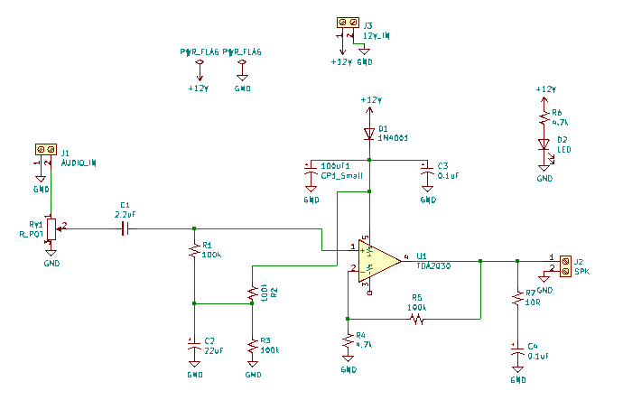
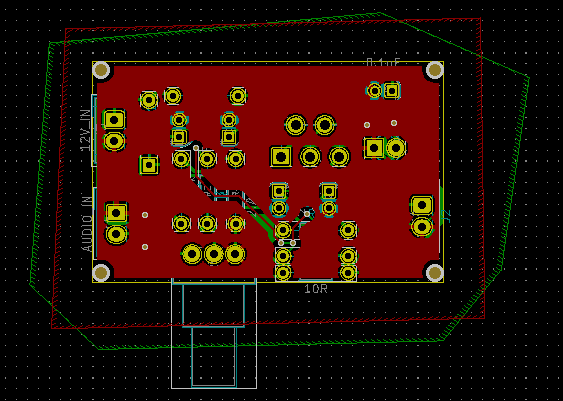
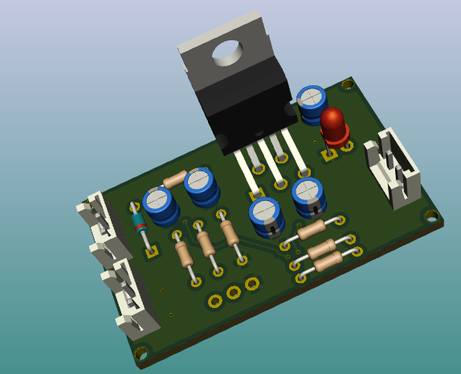

## Class AB Audio Amplifier With TDA2030
### Introduction
The amplifier shown below uses the very versatile monolithic IC TDA2030 audio amplifier
to amplify the audio input from a 3.5mm Jack to power a subwoofer. It delivers an
output of 12W for 4 Ohm speaker and 8W for a 8 Ohm speaker.

### Schematic

From the AUDIO_IN input, RV1 is a volume control knob. The amplifier is DC coupled
with C1. C1 and R1 form a high pass filter network to allow high freq signals
to be amplified.

TDA2030 is powered with 12V VCC. The 1N4001 Diode is a reverse protection component
to prevent the capacitors CP1 and C3 from getting damaged. R2 is a potential divider to bias the IC.

CP1, C3 and C2 are noise filters. 

The gain for this circuit is set by R5 and R4 and is given by: -R5/R4, which in this
case gives 25.6 dB. 

The series network formed by R7 and C4 is a Zobel network used to correct some of the 
internal amplifier inefficiencies. 

### Layout  

There are ground copper fills on both the front and back copper sides to drive the 
noise to ground and prevent background hissing

### 3D view

